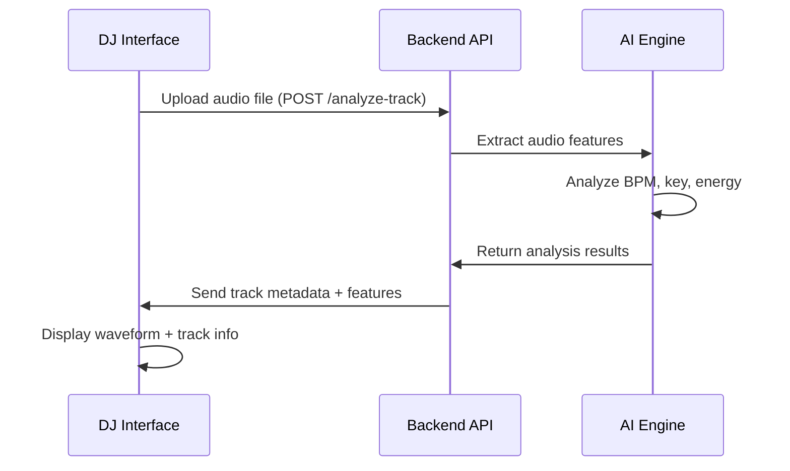
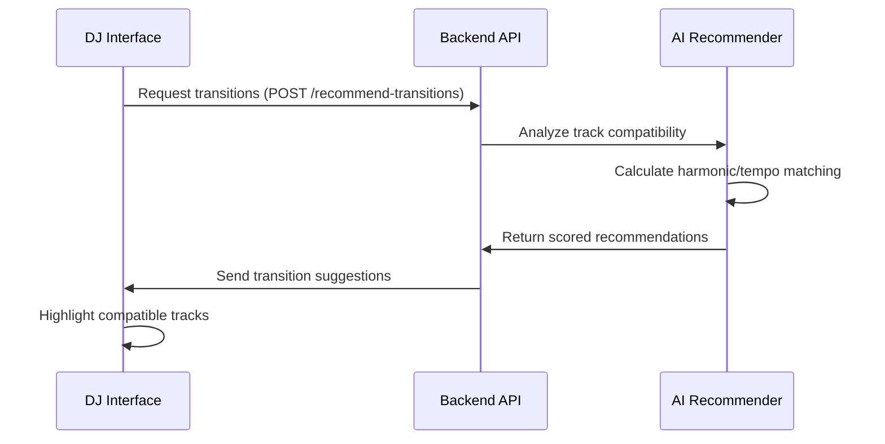

# DJ AI App - Complete AI-Powered DJ System Orchestrator

**Author**: Sergie Code - Software Engineer & YouTube Programming Educator  
**Purpose**: AI tools for musicians - Complete DJ AI ecosystem orchestrator  
**Platform**: Windows PowerShell environment with Docker support

---

## 🎯 Project Overview

**DJ AI App** is the main orchestrator for the complete AI-powered DJ system, coordinating the seamless integration between:

- **[dj-ai-core](https://github.com/sergiecode/dj-ai-core)**: FastAPI backend with AI-powered audio analysis and transition recommendations
- **[dj-ai-frontend](https://github.com/sergiecode/dj-ai-frontend)**: React-based interactive DJ interface with waveform visualization
- **Docker Compose**: Unified development and production environment management

This orchestrator provides a single entry point to run the entire DJ AI ecosystem, handling service coordination, networking, and environment configuration.

---

## 🏗️ System Architecture

```
DJ AI App (Orchestrator)
├── 🎛️ Frontend (React + Waveform Visualization)
│   ├── Audio file upload and management
│   ├── Interactive DJ mixing interface
│   ├── Real-time waveform display
│   └── AI recommendation visualization
│
├── 🧠 Backend (FastAPI + AI Analysis)
│   ├── Audio feature extraction (BPM, Key, Energy)
│   ├── Machine learning transition recommendations
│   ├── Real-time audio processing
│   └── RESTful API for frontend integration
│
├── 🌐 Nginx Proxy (Production)
│   ├── Load balancing and SSL termination
│   ├── API routing and rate limiting
│   └── Static file serving optimization
│
└── 🐳 Docker Infrastructure
    ├── Service orchestration and networking
    ├── Environment-specific configurations
    └── Health monitoring and auto-restart
```

---

## 🚀 Quick Start

### Prerequisites

- **Docker Desktop** (latest version)
- **Git** for repository management
- **PowerShell** (Windows) or compatible shell
- **8GB+ RAM** recommended for AI processing

### 1. Repository Setup

```powershell
# Clone the orchestrator (this repository)
git clone https://github.com/sergiecode/dj-ai-app.git
cd dj-ai-app

# Clone the required services (same directory level)
git clone https://github.com/sergiecode/dj-ai-core.git ../dj-ai-core
git clone https://github.com/sergiecode/dj-ai-frontend.git ../dj-ai-frontend

# Verify directory structure
tree /a
```

**Expected Directory Structure:**
```
IA/
├── dj-ai-app/          # This orchestrator repository
├── dj-ai-core/         # Backend API service
└── dj-ai-frontend/     # Frontend React application
```

### 2. Initial Setup

```powershell
# Run the setup script
.\scripts\setup.ps1

# This will:
# - Check prerequisites (Docker, repositories)
# - Create necessary directories and configurations
# - Set up environment files
```

### 3. Start Development Environment

```powershell
# Start all services in development mode
.\scripts\start-dev.ps1

# Optional flags:
# -Build    Force rebuild Docker images
# -Logs     Show live logs (blocks terminal)
# -Clean    Clean up before starting
```

### 4. Access the Application

Once started, the system will be available at:

- **🎛️ DJ Interface**: http://localhost:3000
- **🧠 API Backend**: http://localhost:8000
- **📚 API Documentation**: http://localhost:8000/docs
- **💚 Health Check**: http://localhost:8000/health

---

## 🎵 How It Works - Frontend ↔ Backend Integration

### 1. Audio Upload and Analysis Flow



**Example Integration:**
```javascript
// Frontend uploads audio file
const analyzeTrack = async (audioFile) => {
  const formData = new FormData();
  formData.append('file', audioFile);
  
  const response = await fetch('http://localhost:8000/analyze-track', {
    method: 'POST',
    body: formData
  });
  
  return response.json();
  // Returns: { track_id, bpm, key, duration, features }
};
```

### 2. AI-Powered Transition Recommendations



**Example Integration:**
```javascript
// Frontend requests AI recommendations
const getTransitions = async (currentTrack, availableTracks) => {
  const response = await fetch('http://localhost:8000/recommend-transitions', {
    method: 'POST',
    headers: { 'Content-Type': 'application/json' },
    body: JSON.stringify({
      current_track_id: currentTrack.id,
      available_tracks: availableTracks
    })
  });
  
  return response.json();
  // Returns: { recommendations: [{ track_id, compatibility_score, transition_type }] }
};
```

### 3. Real-Time DJ Controls

The frontend provides interactive DJ controls that communicate with the backend for:

- **Waveform Visualization**: Audio data processed by backend, rendered by frontend
- **BPM Synchronization**: Real-time tempo matching using AI analysis
- **Key Detection Display**: Harmonic information for perfect mixing
- **Cue Point Suggestions**: AI-recommended mix entry/exit points

---

## 🛠️ Development Commands

### Service Management

```powershell
# Start development environment
.\scripts\start-dev.ps1

# Start production environment  
.\scripts\start-prod.ps1

# Check service health
.\scripts\health-check.ps1

# Stop all services
.\scripts\stop.ps1

# Stop and clean up
.\scripts\stop.ps1 -Clean
```

### Docker Commands

```powershell
# View running services
docker-compose ps

# View logs
docker-compose logs -f

# View specific service logs
docker-compose logs -f dj-ai-core
docker-compose logs -f dj-ai-frontend

# Rebuild services
docker-compose build

# Scale services (production)
docker-compose up -d --scale dj-ai-core=2
```

### Development Workflow

```powershell
# 1. Make changes to backend (dj-ai-core)
#    Files are automatically synced in development mode

# 2. Make changes to frontend (dj-ai-frontend)  
#    Hot reload is enabled for React development

# 3. Test changes
.\scripts\health-check.ps1

# 4. View logs for debugging
docker-compose logs -f
```

---

## 🌍 Environment Configurations

### Development Mode (`docker-compose.dev.yml`)

- **Hot Reload**: Automatic code reloading for both services
- **Debug Logging**: Detailed logs for development
- **Volume Mounting**: Live code synchronization
- **CORS**: Permissive for localhost development

### Production Mode (`docker-compose.prod.yml`)

- **Nginx Proxy**: Load balancing and SSL termination
- **Optimized Builds**: Multi-stage Docker builds
- **Security Headers**: Production security configurations
- **Rate Limiting**: API protection and throttling

### Environment Variables

```bash
# Backend Configuration
API_HOST=0.0.0.0
API_PORT=8000
CORS_ORIGINS=http://localhost:3000

# Frontend Configuration  
REACT_APP_API_URL=http://localhost:8000

# Docker Configuration
COMPOSE_PROJECT_NAME=dj-ai-app
```

---

## 📊 Service Monitoring

### Health Checks

The system includes comprehensive health monitoring:

```powershell
# Automated health check script
.\scripts\health-check.ps1

# Manual endpoint checks
curl http://localhost:8000/health      # Backend health
curl http://localhost:3000             # Frontend availability
curl http://localhost:8000/docs        # API documentation
```

### Service Dependencies

```yaml
# Frontend waits for backend to be healthy
depends_on:
  dj-ai-core:
    condition: service_healthy

# Health check configuration
healthcheck:
  test: ["CMD-SHELL", "curl -f http://localhost:8000/health || exit 1"]
  interval: 30s
  timeout: 10s
  retries: 3
  start_period: 40s
```

---

## 🎨 Frontend Features Integration

### Audio Upload Interface
- **Drag & Drop**: Seamless file upload experience
- **Format Support**: MP3, WAV, FLAC, M4A compatibility
- **Progress Tracking**: Real-time upload and analysis progress
- **Error Handling**: User-friendly error messages

### Waveform Visualization
- **Wavesurfer.js**: High-performance audio visualization
- **Beat Grid**: Visual BPM markers and beat alignment
- **Cue Points**: AI-suggested entry and exit points
- **Zooming**: Detailed waveform inspection

### DJ Controls
- **Dual Deck**: Two-deck DJ interface simulation
- **Crossfader**: Smooth transitions between tracks
- **Tempo Control**: BPM adjustment with pitch preservation
- **Loop Controls**: Beat-accurate looping functionality

### AI Features Display
- **Compatibility Scores**: Visual recommendation confidence
- **Key Matching**: Harmonic mixing suggestions
- **Transition Types**: Different mixing technique recommendations
- **Real-time Updates**: Live AI analysis results

---

## 🧠 Backend AI Capabilities

### Audio Analysis Engine
- **BPM Detection**: Advanced tempo analysis with confidence scoring
- **Key Detection**: Musical key analysis using chromagram analysis
- **Energy Analysis**: Track energy and mood detection
- **Feature Extraction**: 13+ audio features for ML processing

### Machine Learning Models
- **Transition Prediction**: Neural networks for mix compatibility
- **Harmonic Analysis**: Key relationship modeling
- **Tempo Matching**: BPM synchronization algorithms
- **Pattern Recognition**: Beat and phrase structure detection

### API Endpoints Integration

```http
POST /analyze-track
Content-Type: multipart/form-data

# Returns detailed track analysis
{
  "track_id": "unique-id",
  "bpm": 128.5,
  "key": "C major", 
  "duration": 245.6,
  "features": {
    "spectral_centroid": 2456.7,
    "energy": 0.82,
    "tempo_confidence": 0.92
  }
}

POST /recommend-transitions  
Content-Type: application/json

# Returns AI-powered mixing suggestions
{
  "recommendations": [
    {
      "track_id": "track-2",
      "compatibility_score": 0.87,
      "transition_type": "harmonic_mix",
      "suggested_cue_point": 120.5
    }
  ]
}
```

---

## 🔧 Production Deployment

### Docker Production Setup

```powershell
# Start production mode
.\scripts\start-prod.ps1

# With SSL certificate
.\scripts\start-prod.ps1 -SSL

# With monitoring
.\scripts\start-prod.ps1 -Monitor
```

### Nginx Configuration

The production setup includes:
- **Load Balancing**: Multiple backend instances
- **SSL Termination**: HTTPS support with certificates  
- **Rate Limiting**: API protection (10 req/s, uploads 2 req/s)
- **Caching**: Static file optimization
- **Security Headers**: Production security standards

### Scaling Services

```powershell
# Scale backend for higher load
docker-compose up -d --scale dj-ai-core=3

# Monitor resource usage
docker stats

# View service distribution
docker-compose ps
```

---

## 📁 Project Structure

```
dj-ai-app/
├── 📋 README.md                    # This documentation
├── 🐳 docker-compose.yml           # Main service definitions
├── 🛠️ docker-compose.dev.yml       # Development overrides
├── 🚀 docker-compose.prod.yml      # Production overrides
├── ⚙️ .env.development             # Development environment
├── 🔒 .env.production              # Production environment
├── 📂 config/
│   ├── nginx.conf                  # Nginx configuration
│   └── ssl/                        # SSL certificates
├── 📂 scripts/
│   ├── setup.ps1                   # Initial setup
│   ├── start-dev.ps1              # Development startup
│   ├── start-prod.ps1             # Production startup
│   ├── stop.ps1                   # Service shutdown
│   └── health-check.ps1           # Health monitoring
└── 📂 data/
    ├── uploads/                    # Audio file storage
    └── models/                     # ML model storage
```

---

## 🎓 Educational Content & YouTube Integration

### Programming Tutorial Series

This project serves as the foundation for educational content on Sergie Code's YouTube channel:

1. **"Building an AI DJ System"** - Complete full-stack development series
2. **"Docker for Musicians"** - DevOps and containerization for creative projects
3. **"React Audio Visualization"** - Frontend development with Web Audio API
4. **"FastAPI for Real-time Applications"** - Backend development with Python
5. **"Machine Learning for Music"** - AI/ML applications in audio processing

### Learning Objectives

- **Full-Stack Development**: Complete application architecture
- **Microservices**: Service separation and communication
- **Docker Orchestration**: Container management and deployment
- **Real-time Audio Processing**: Web Audio API and backend integration
- **Machine Learning Integration**: AI/ML in practical applications
- **Modern Development Workflow**: Git, Docker, testing, and deployment

---

## 🛡️ Security & Performance

### Security Features

```yaml
# Rate limiting per endpoint
location /api/analyze-track {
    limit_req zone=upload burst=5 nodelay;
}

# Security headers
add_header X-Frame-Options "SAMEORIGIN" always;
add_header X-XSS-Protection "1; mode=block" always;
add_header X-Content-Type-Options "nosniff" always;
```

### Performance Optimization

- **Async Processing**: Non-blocking audio analysis
- **Caching**: Redis for analysis results (optional)
- **File Size Limits**: 50MB max upload size
- **Timeout Management**: Appropriate timeouts for AI processing
- **Health Monitoring**: Automatic service restart on failure

---

## 📚 API Integration Examples

### Complete Frontend Integration

```typescript
// DJ AI API Client
class DJAIClient {
  constructor(baseUrl = 'http://localhost:8000') {
    this.baseUrl = baseUrl;
  }

  async analyzeTrack(file: File): Promise<TrackAnalysis> {
    const formData = new FormData();
    formData.append('file', file);
    
    const response = await fetch(`${this.baseUrl}/analyze-track`, {
      method: 'POST',
      body: formData,
    });
    
    if (!response.ok) {
      throw new Error(`Analysis failed: ${response.statusText}`);
    }
    
    return response.json();
  }

  async getRecommendations(
    currentTrack: string, 
    availableTracks: Track[]
  ): Promise<TransitionRecommendations> {
    const response = await fetch(`${this.baseUrl}/recommend-transitions`, {
      method: 'POST',
      headers: { 'Content-Type': 'application/json' },
      body: JSON.stringify({
        current_track_id: currentTrack,
        available_tracks: availableTracks,
      }),
    });
    
    return response.json();
  }
}

// React Integration Hook
export const useDJAI = () => {
  const [client] = useState(() => new DJAIClient());
  const [isAnalyzing, setIsAnalyzing] = useState(false);
  const [trackLibrary, setTrackLibrary] = useState<Track[]>([]);

  const analyzeAndAddTrack = async (file: File) => {
    setIsAnalyzing(true);
    try {
      const analysis = await client.analyzeTrack(file);
      const newTrack: Track = {
        id: analysis.track_id,
        name: file.name,
        bpm: analysis.bpm,
        key: analysis.key,
        duration: analysis.duration,
        features: analysis.features,
      };
      
      setTrackLibrary(prev => [...prev, newTrack]);
      return newTrack;
    } finally {
      setIsAnalyzing(false);
    }
  };

  const getTransitionRecommendations = async (currentTrack: Track) => {
    const otherTracks = trackLibrary.filter(t => t.id !== currentTrack.id);
    return client.getRecommendations(currentTrack.id, otherTracks);
  };

  return {
    analyzeAndAddTrack,
    getTransitionRecommendations,
    isAnalyzing,
    trackLibrary,
  };
};
```

---

## 🚨 Troubleshooting

### Common Issues

**Docker Issues:**
```powershell
# Docker Desktop not running
# Solution: Start Docker Desktop and wait for it to be ready

# Port conflicts
# Solution: Stop conflicting services or change ports in .env

# Out of disk space
# Solution: Clean up Docker resources
docker system prune -a --volumes
```

**Service Health Issues:**
```powershell
# Check service logs
docker-compose logs dj-ai-core
docker-compose logs dj-ai-frontend

# Restart unhealthy services
docker-compose restart dj-ai-core

# Full rebuild
docker-compose down && docker-compose up --build
```

**Audio Processing Issues:**
```powershell
# Check supported formats
curl http://localhost:8000/supported-formats

# Verify file upload limits
# Check MAX_FILE_SIZE in .env file

# Debug audio analysis
docker-compose logs dj-ai-core | grep -i error
```

### Getting Help

1. **Check Service Status**: `.\scripts\health-check.ps1`
2. **View Logs**: `docker-compose logs -f`
3. **Restart Services**: `.\scripts\stop.ps1 && .\scripts\start-dev.ps1`
4. **Clean Rebuild**: `.\scripts\start-dev.ps1 -Clean -Build`

---

## 🤝 Contributing

This project is part of the educational content on **Sergie Code's YouTube channel**. Contributions are welcome for:

- **Bug fixes and improvements**
- **Educational enhancements**
- **Documentation improvements**
- **Performance optimizations**
- **New AI features**

### Development Workflow

1. Fork the repository
2. Create a feature branch
3. Make your changes
4. Test with `.\scripts\health-check.ps1`
5. Submit a pull request

---

## 👨‍💻 About the Creator

**Sergie Code** is a software engineer and YouTube programming educator passionate about making technology accessible to musicians and creators. This DJ AI system represents the intersection of music technology, artificial intelligence, and modern software development practices.

### Connect & Learn

- **YouTube**: [Sergie Code Programming Tutorials](https://youtube.com/@sergiecode)
- **Focus**: AI tools for musicians and creative technology
- **Mission**: Empowering musicians through accessible technology education

- 📸 Instagram: https://www.instagram.com/sergiecode

- 🧑🏼‍💻 LinkedIn: https://www.linkedin.com/in/sergiecode/

- 📽️Youtube: https://www.youtube.com/@SergieCode

- 😺 Github: https://github.com/sergiecode

- 👤 Facebook: https://www.facebook.com/sergiecodeok

- 🎞️ Tiktok: https://www.tiktok.com/@sergiecode

- 🕊️Twitter: https://twitter.com/sergiecode

- 🧵Threads: https://www.threads.net/@sergiecode

---

## 🎉 Ready to Mix!

Your complete AI-powered DJ system is now ready! The orchestrator provides seamless integration between the React frontend and FastAPI backend, giving you:

✅ **Professional DJ Interface** with waveform visualization  
✅ **AI-Powered Track Analysis** with BPM and key detection  
✅ **Smart Transition Recommendations** using machine learning  
✅ **Production-Ready Deployment** with Docker and Nginx  
✅ **Educational Platform** for learning modern development  

**Start creating amazing mixes with the power of AI! 🎵🤖💻**

---

*Built with ❤️ by Sergie Code - Empowering musicians through technology education*
